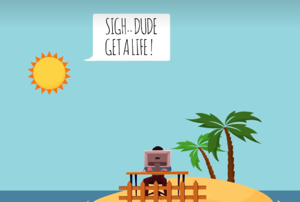

# 如何悲惨的度过一生

[video](https://www.bilibili.com/video/BV17P4y127ub/?is_story_h5=false&p=1&share_from=ugc&share_medium=android&share_plat=android&share_session_id=7c95183a-8058-4728-b2cd-bc82f416b3e1&share_source=WEIXIN&share_tag=s_i&timestamp=1670312510&unique_k=GN0LAJQ&vd_source=0b745a043df03b2811f9309ce3aaad13)

## 成为一座孤岛

自我孤立、画地为牢、建起围墙、紧闭大门、打开电脑、骗自己已成功替换了现实社交联系。

## 过于认真、小题大做、杞人忧天

让自己变得煞气腾腾，遥远不可亲近，与讨厌的人远离

## 缅怀过去、忧虑未来

## 把所有目标抛之脑后，使自己完全失去方向

SMART（Specific、Measurable、Actionable、Realistic and Time-Defined）VAPID（Vague、Amorphous、Pie in the sky、Irrelevant and Delayed），只关注最终目标，而不关注脚下的每一步，兴趣丧失、士气低落

## 让恐惧麻痹自己，永远不离开舒适区

不去改变自己的生活，停止进步、停止渴望更多，只是坐等天上掉馅饼，只是坐等时间消磨。

